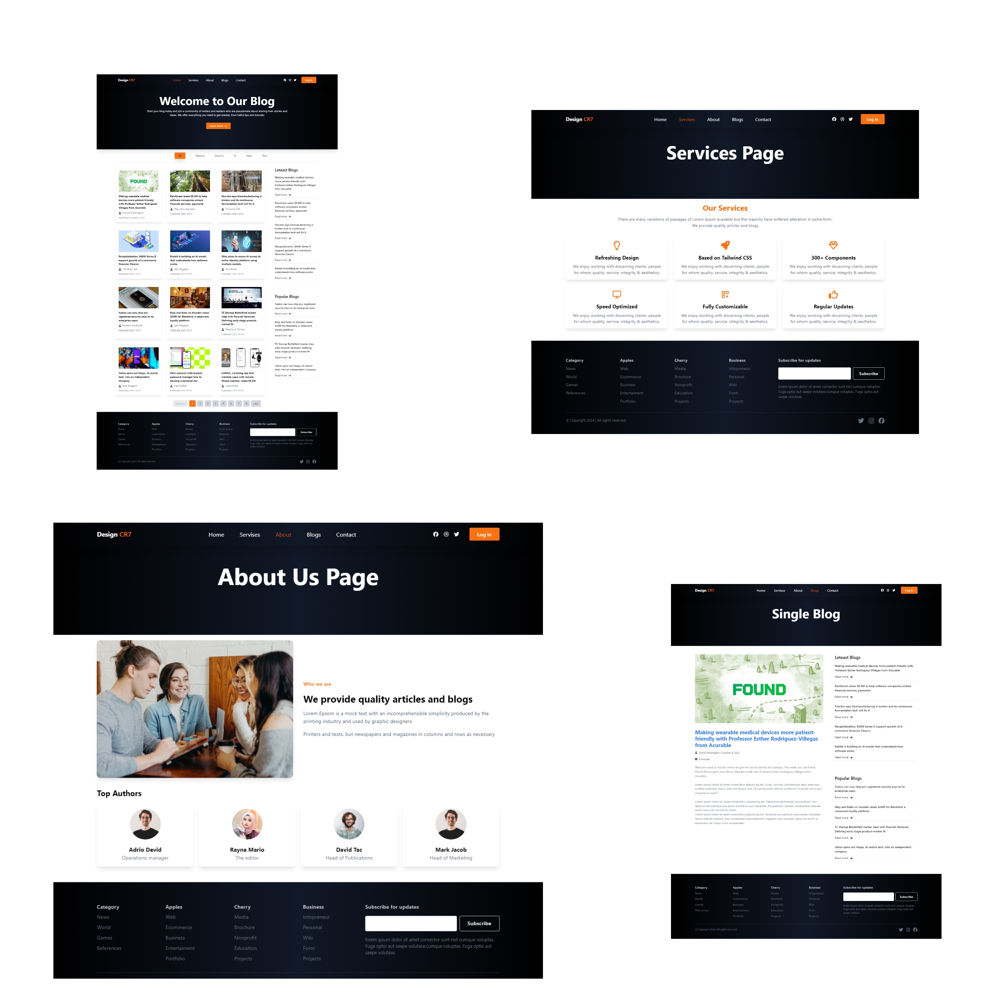

# React-Blog-Website

## Description: 
  Developed a dynamic and responsive Blog Website using React.js, featuring an intuitive interface for reading and managing blog posts. The project leverages React Router for seamless navigation between different sections of the site, providing a smooth user experience.
## Key Features:
### Home Page and Blog Listings:
  Created a responsive home page that displays the latest blog posts with previews and categories.
  Implemented a dynamic blog listing page where users can filter posts by category and search for specific topics.
### Blog Post Details Page:
  Developed a detailed view page for individual blog posts, including the full content, author information, and related posts.
  Ensured that the transition between blog listings and detailed views is smooth, using React Router for route management.
### Navigation and Responsiveness:
  Designed a responsive navigation menu that adapts to different screen sizes, providing easy access to various sections such as Home, Categories, and About.
  Utilized Tailwind CSS for rapid UI development and consistent styling across the site, ensuring a modern and cohesive design.
## Technologies Used: React.js, React Router, Tailwind CSS

